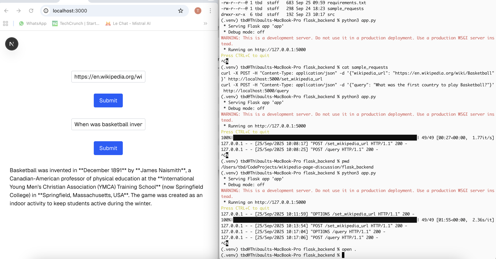

# wikipedia-page-discussion

A simple RAG based application to talk to a Wikipedia web page.

Install and start flask backend:

```python
cd flask_backend
python3 -m venv .venv
source .venv/bin/activate
pip install -r requirements.txt
python3 app.py
```

Test Flask backend:

```python
Last login: Thu Sep 25 09:48:18 on ttys000
tbd@Thibaults-MacBook-Pro ~ % curl -X POST -H "Content-Type: application/json" -d '{"wikipedia_url": "https://en.wikipedia.org/wiki/Basketball"}' http://localhost:5000/set_wikipedia_url
{"status":"Succeeded"}
tbd@Thibaults-MacBook-Pro ~ % curl -X POST -H "Content-Type: application/json" -d '{"query": "What was the first country to play Basketball?"}' http://localhost:5000/query
{"answer":"Based on the provided context, the first country to play basketball was the **United States**.\n\nThe game was invented by **James Naismith** in **December 1891** at the **International YMCA Training School in Springfield, Massachusetts**, and the first official game was played in **Albany, New York, on January 20, 1892**. Thus, the U.S. is where basketball originated and was first played."}
```

Start frontend application:

```shell
tbd@Thibaults-MacBook-Pro wikipedia-page-discussion % cd frontend-app
tbd@Thibaults-MacBook-Pro frontend-app % npm install

up to date, audited 332 packages in 696ms

136 packages are looking for funding
  run `npm fund` for details

found 0 vulnerabilities
tbd@Thibaults-MacBook-Pro frontend-app % npm run dev

> frontend-app@0.1.0 dev
> next dev

   ▲ Next.js 15.5.3
   - Local:        http://localhost:3000
   - Network:      http://10.16.136.189:3000

 ✓ Starting...
 ✓ Ready in 1277ms
```


